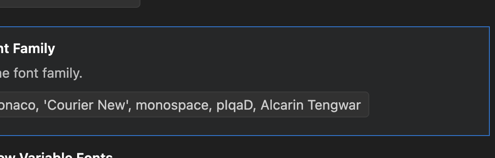

# Adding a New Language

Adding a new language to WordClock involves defining the logic for telling time, generating a letter grid, and ensuring the necessary fonts are available.

### Developer Note: Font Configuration

If you are developing for languages with custom scripts (e.g., Sindarin, Klingon), please configure your IDE's editor font to include the necessary fonts as fallbacks.

Recommended Font Family setting:
`Menlo, Monaco, 'Courier New', monospace, pIqaD, 'Alcarin Tengwar'`



## 1. Create Language File

Create a new file in `lib/languages/natural/<language>.dart` (or `lib/languages/conlangs/<language>.dart`). You need to extend `WordClockLanguage` and implement the `timeToWords` logic.

```dart
class MyNewLanguage extends WordClockLanguage {
  // ... implementation ...
}
```

## 2. Register Language

Add your new language instance to the `WordClockLanguages.all` list in `lib/languages/all.dart`.

```dart
static final List<WordClockLanguage> all = [
  // ...
  myNewLanguage,
  // ...
];
```

## 3. Generate Grid

Use the `grid_builder` tool to generate an optimized letter grid for your language. This tool uses backtracking to verify that all possible 5-minute time intervals can be displayed on the grid.

```bash
# Example: Generate a 11x10 grid for your language and update the file
dart run bin/grid_builder.dart solve --lang=<LANG_ID> --width=11 --height=10 -u
```

The `-u` (or `--update`) flag will automatically locate your language file and insert the generated grid. If you omit this flag, the tool will print the grid code to the console for you to copy-paste.

## 4. Build Fonts

WordClock uses subsetted fonts to minimize app size and work offline. You must rebuild the fonts to include any new characters from your added language.

**Step A: Extract Characters**
Run the extraction script to scan the codebase and language files for every character used.
```bash
dart run tool/extract_chars.dart
# Generates characters.txt
```

**Step B: Subset Fonts**
Run the shell script to download source fonts and generate optimized subsets.
```bash
./tool/subset_fonts.sh
```


## 6. Register Fonts

If you introduced a new font family:

1.  **Add License File**: Place the font's license file (e.g., `OFL_MyFont.txt`) in `assets/fonts/`.
2.  **Update Pubspec**: Add the license file to `pubspec.yaml` under `assets`.
3.  **Register License**: In `lib/main.dart`, add a `LicenseRegistry.addLicense` entry for the new font.
4.  **Configure Weights**:
    - **Variable Fonts**: List only the single variable asset. Do **not** specify `weight`. Flutter will automatically map `FontWeight` to the `wght` axis.
    - **Static Fonts**: If only a regular version is available, list it without a `weight` property. Flutter defaults this to `w400` and will apply "Synthetic Bolding" when `w700` is requested in the UI.

```dart
LicenseRegistry.addLicense(() async* {
  final myFontLicense = await rootBundle.loadString('assets/fonts/OFL_MyFont.txt');
  yield LicenseEntryWithLineBreaks(['MyFontFamily'], myFontLicense);
});
```

8.  **Verify Fonts**:
    If you've added or modified fonts, you can use the Font Debugger to verify they render correctly at various weights:
    ```bash
    flutter run -d chrome -t lib/main_debug_fonts.dart
    ```

## 7. Verify

Run the tests to ensure everything is wired up correctly and no font loading errors occur.

```bash
flutter test
```
